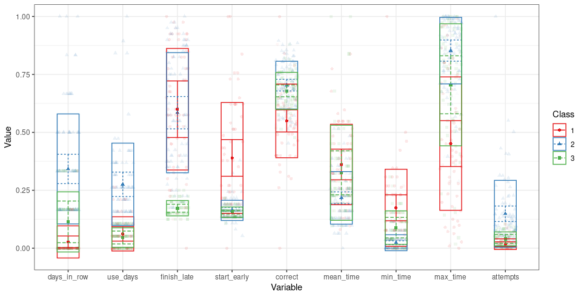

```{r setup, include=FALSE}
knitr::opts_chunk$set(echo = TRUE, message = F, warning = F)
```

## basics

```{r}
library(tidyverse)
```


## Data

What is this dataset?

How familiar are your with mtcars?

Do you hate them?

```{r}
?mtcars
```

```{r}
mtcars |> 
  head()
```

## base recap

### dimensions of data

Lets warm up your R (tydyverse) skills and make use of Nastay's lecture

```{r}
mtcars |> 
ggplot(aes(x  =wt, y = mpg)) +
  geom_point()+
  ggtitle("2 Dimensions")+
  theme_minimal()
```

What is wrong with the following visualization?

```{r}
mtcars |> 
ggplot(aes(x  =wt, y = mpg, color = gear)) +
  geom_point()+
  ggtitle("3 Dimensions, continious?")+
  theme_minimal()
```

What is the difference between categorical variable and factor?

```{r}
mtcars |> 
ggplot(aes(x  =wt, y = mpg, color = gear |> as_factor())) +
  geom_point()+
  ggtitle("3 Dimensions")+
  theme_minimal()
```

How easy is to read the following graph?

```{r}
mtcars |> 
ggplot(aes(x  =wt, y = mpg, 
           color = gear |> as_factor(),
           size = cyl)) +
  geom_point()+
  ggtitle("4 Dimensions")+
  theme_minimal()
```

What is the difference between these two graphs? How different will be your story?

```{r}
mtcars |> 
ggplot(aes(x =wt, y = mpg, 
           color = gear |> as_factor(),
           size = cyl |> as.factor())) +
  geom_point()+
  facet_wrap(~cyl)+ 
  ggtitle("4 Dimensions", "distinct by Number of cylinders")+
  theme_minimal()
```

Try to fix this on you own

```{r}
mtcars |> 
ggplot(aes(x =wt, y = mpg, 
           color = gear |> as_factor(),
           size = cyl |> as.factor())) +
  geom_point()+
  stat_smooth(method='lm')+
  facet_wrap(~cyl)+
  ggtitle("4 Dimensions", "with statistics, but something is wrong")+
  theme_minimal()
```

Or look at the solution right away

What is the goal for adding statistics on graphs?

```{r}
mtcars |> 
ggplot(aes(x =wt, y = mpg, 
           color = gear |> as_factor())) +
    geom_smooth(method='lm')+
  geom_point(aes(size = cyl |> as.factor()))+
  # facet_wrap(~cyl)+
  ggtitle("4 Dimensions", "with statistics")+
  theme_minimal()
```

Complex layers could be made of simpler one, thus giving us more customization

```{r}
mtcars |> 
ggplot(aes(x =wt, y = mpg, 
           color = gear |> as_factor())) +
  geom_smooth(method='lm', alpha = 0.1, size = 0)+
  geom_line(stat="smooth",method = "lm", size  = 1.5, alpha = 0.5)+
  geom_point(aes(size = cyl |> as.factor()))+
  ggtitle("4 Dimensions", "with statistics from basic attributes")+
  theme_minimal()
```

### colors!

```{r}
mtcars |> 
ggplot(aes(x =wt, y = mpg, 
           color = gear |> as_factor())) +
  geom_smooth(method='lm', alpha = 0.1, size = 0)+
  geom_line(stat="smooth",method = "lm", size  = 1.5, alpha = 0.5)+
  geom_point(aes(size = cyl |> as.factor()))+
  ggtitle("4 Dimensions", "with statistics from basic attributes")+
  scale_color_brewer(palette = "Set1")+
  theme_minimal()
```

### more color

see [see](https://github.com/easystats/see) for more color

```{r}
library(see)
# https://github.com/easystats/see

mtcars |> 
ggplot(aes(x =wt, y = mpg, 
           color = gear |> as_factor())) +
  geom_smooth(method='lm', alpha = 0.1, size = 0)+
  geom_line(stat="smooth",method = "lm", size  = 1.5, alpha = 0.5)+
  geom_point(aes(size = cyl |> as.factor()))+
  ggtitle("4 Dimensions", "with statistics from basic attributes")+
  # see::scale_color_material_d()+
  see::scale_color_social()+
  theme_minimal()
```

## real data

```{r}
bikes <- read_csv("data/Bike Sharing Demand.csv")
bikes |> head()

```

```{r}
bikes |> 
  ggplot(aes(x = holiday))+
  geom_bar()+
  theme_minimal()
```

You could try to turn count into percentage following the tutorial

[How to plot a 'percentage plot' with ggplot2 -- Sebastian Sauer Stats Blog](https://sebastiansauer.github.io/percentage_plot_ggplot2_V2/)

```{r}
# bikes |> 

```

```{r}
bikes |> 
  group_by(holiday) |> 
  summarise(count = sum(count)) |> 
    ggplot(aes(x = holiday, y = count))+
    geom_bar(stat = "identity")+
    theme_minimal()
```

```{r}
bikes |> 
  mutate(holiday = holiday |> as.logical()) |> 
    ggplot(aes(x = holiday, y = count))+
    geom_boxplot()+
    theme_minimal()
```

Why do we have almost the same median for holidays and non holidays?

```{r}
bikes |> 
  mutate(holiday = holiday |> as.logical()) |> 
    ggplot(aes(x = holiday, y = count))+
    geom_boxplot()+
    geom_jitter(alpha = 0.1)+
    theme_minimal()
```

```{r}
bikes |> 
  mutate(holiday = holiday |> as.logical()) |> 
    ggplot(aes(x = holiday, y = count))+
    geom_violin(draw_quantiles = c(0.25, 0.5, 0.75), trim = FALSE)+
    geom_jitter(alpha = 0.1)+
    theme_minimal()
```

```{r}
library(ggpubr)

bikes |> 
  ggboxplot(x = "holiday", y = "count",
            color = "holiday", palette =c("#00AFBB", "#E7B800")) -> p
p

 # Add p-values comparing groups
 # Specify the comparisons you want
my_comparisons <- list( c(0, 1))
p + 
  stat_compare_means(comparisons = my_comparisons)+ 
  # Add pairwise comparisons p-value
  stat_compare_means(label.y = 50)                   # Add global p-value
```

```{r}
bikes |> 
  ggboxplot(x = "season", y = "count",
            color = "season", palette ="npg") -> p2
p2

 # Add p-values comparing groups
 # Specify the comparisons you want
my_comparisons <- combn(c(1, 2, 3, 4), m = 2, simplify = F)
p2 + 
  stat_compare_means(comparisons = my_comparisons)+ 
  # Add pairwise comparisons p-value
  stat_compare_means(label.y = 1600)
```

### manipulations and data quality

```{r}
bikes |> 
  ggplot(aes(x = atemp, y = count))+
  geom_point()+
  geom_smooth(method = "lm")+
  theme_minimal()
```

```{r}
bikes |> 
  ggplot(aes(x = atemp, y = count))+
  geom_point()+
  geom_smooth(method = "lm")+
  theme_minimal()+
    scale_y_log10()
```

```{r}
bikes |> 
  filter(atemp>=30 & atemp <=45) |> 
  ggplot(aes(x = atemp, y = count))+
  geom_point()+
  geom_smooth(method = "lm")+
    scale_y_log10()+
  xlim(30, 45)+
  theme_minimal()
```

### kind of a solution

```{r}
bikes |> 
  ggplot(aes(x = atemp, y = count))+
  geom_jitter(width = 0.2, height = 0.2, alpha = 0.4)+
  geom_smooth(method = "lm")+
  scale_y_log10()+
  theme_minimal()
```

```{r}
bikes |> 
  ggplot(aes(x = atemp, y = count))+
  geom_jitter(width = 0.2, height = 0.2, alpha = 0.4)+
  geom_smooth(method = "lm")+
  scale_y_log10()+
  theme_minimal()
```

### diamonds

```{r}
?diamonds

diamonds |> 
  head()
```

```{r}
diamonds |> 
  ggplot(aes(x = carat, y = price))+
  geom_point()+
  theme_minimal()
```

```{r}
diamonds |> 
  ggplot(aes(x = carat, y = price))+
  geom_point()+
  scale_x_log10()+
  scale_y_log10()+
  theme_minimal()
```

```{r}
diamonds |> 
  # sample_frac(0.1) |> 
  ggplot(aes(x = carat, y = price, color = cut))+
  geom_point(alpha = 0.1)+
  scale_x_log10()+
  scale_y_log10()+
  theme_minimal()
```

## Questions to think about

1.  What to do if there is too much data?
2.  Linear regression and age, can you start age at 18 if respondents with less age
3.  What other quantities would be good to logarithmize?

### Self practice

1.  Посчитайте, сколько праздничных дней в каждом году
2.  Правда ли, что в праздники арендуют больше, чем в обычные дни
3.  Добавим к праздникам выходные. Правда ли, что в праздники и выходные арендуют больше, чем в обычные дни?
4.  Связано ли количество арендованных велосипедов и температура
5.  Отличается ли спрос по годам
6.  Отличается ли спрос по временам года?
7.  Отличается ли спрос в выходные-не выходные по временам года
8.  Связано ли количество арендованных велосипедов и влажность?

## HW

Есть данные и два варианта задания:

1.  Повторить картинку. Она странная, и плохая, попробуйте её улучшить
2.  С помощью графика\\графиков показать отличия между 3 группами студентов, но не рисуйте больше 3 графиков. Представьте, что их нужно её в статью пихнуть.

```{r}
df_lp <- read_csv("data/students_data.csv")
df_lp |> skimr::skim()

```

Это почти совсем как настоящий датасет из образовательной аналитики. На одном курсе по юриспруденции в Нидерландах студентам предложили воспользоваться мобильным приложением, где они могли отвечать на вопросы про курс и лучше подготовиться к экзамену. Эти данные кластеризовали каким-то гаусовским алгоритмом и отдали вам для визуализации.

1.  **profile --** выделенный кластер, к которому принадлежат студенты
2.  **days_in_a\_row** -- количество последовательных дней, когда использовали приложение
3.  **use_days --** сколько дней приложение использовали всего
4.  **finish_late --** за сколько дней до начала экзамена студенты прекратили пользоваться приложением
5.  **start_early --** через сколько дней с начала курса студент зашёл в приложение
6.  **correct --** процент правильных ответов
7.  **mean_time, min_time, max_time --** среднее, минимальное и максимальное время ответа в приложении
8.  **attempts --** насколько вопросов попробовал ответить студент


## Additional materials

1.  Wickham, Hadley. "A layered grammar of graphics." Journal of Computational and Graphical Statistics 19, no. 1 (2010): 3-28. <https://doi.org/10.1198/jcgs.2009.07098>
