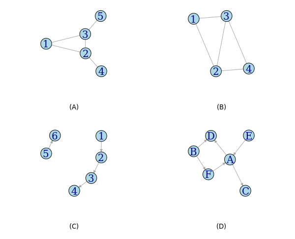

```{r}
library(tidyverse)
```

# Igraph

### "Все связано"
 - взаимосвязи между людьми (профессиональные, дружеские, семейные,..)
 - связи между организациями, союзами, странами...
 - связи между предметами (компьютеры, книги, фильмы...)
 - связи между понятиями
 - ...
 
Два основных понятия -- вершины (узлы, vertices, nodes) и связи (дуги, ребра, links, edges). 

* что может являться вершинами и связями в списке выше?
* приведите свои примеры

Немного примеров


### Формализация сетей -- графы

#### Термины и понятия

* граф (graph)
* вершина, узел (node)
* ребро, связь (edge)
* ориентированные (направленные) / неориентированные графы (directed / undirected graph)
* список ребер (edgelist)
* матрица смежности (adjacency matrix)

#### Инструмент

Мы будем работать с пакетом `igraph` для создания и работы с направленными и ненаправленными графами (<http://igraph.org/r/>)

```{r message=FALSE, warning=FALSE}
library(igraph)
```

#### Небольшие примеры для обсуждения понятий

**Граф** -- способ формально описать взаимосвязи между набором элементов (**вершин, nodes**). 
**Ребро (edge)** -- связь между элементами, представляется как пара вершин (начало-конец)

**Ориентированный граф** -- несимметричная связь, направление важно. **Неориентированный граф** -- симметричная связь (*A* и *B* связаны).

* какие графы являются ориентированными? Неориентированными?
* сколько вершин в графах? Ребер?



### Создание графа
Граф состоит из набора вершин и набора ребер. Один из способов его задания -- определить список ребер **edgelist**, т.е. список пар связанных вершин.

Создадим направленный граф с 5 вершинами и 6 ребрами:
```{r}
exampleGr <- make_graph(c("Mary","Fred", 
                          "Mary","Lee", 
                          "Fred","Lee", 
                          "Elisa","Mary", 
                          "Fred","Sam", 
                          "Sam","Mary"), directed = F)
```

Результат вызова функции `print()` -- описание созданного объекта

```{r}
exampleGr
```

Нарисовать граф можно с помощью функции `plot()`:

```{r}
plot(exampleGr)
```

#### Загрузка графа

Мы рассмотрели пример создания графа вручную, но в большинстве случаев мы будем загружать их из файлов некоторого формата. `igraph` позволяет использовать многие форматы файлов. 

##### Список ребер

`graph_from_data_frame` создает граф igraph из таблицы данных (data frame), **первые два столбца** которого рассматриваются как список ребер (начало - конец), остальные -- как дополнительные свойства ребер.

Рассмотрим искусственную социальную сеть *Krackhardt’s kite*.

```{r}
library(readr)
edgelist <- read_csv("kite.csv")
head(edgelist)

kite <- graph_from_data_frame(edgelist, directed = FALSE) 

plot(kite)
```


##### Матрица смежности (Adjacency matrix)

Еще одно представление графа -- **матрица смежности** (adjacency matrix), т.е. матрица |V|x|V|, где |V| -- число вершин, а элемент в i-ой строке и j-ом столбце равен 1, если есть связь между вершиной i и вершиной j, и 0 в противном случае.

Рассмотрим отношения между семьями Флоренции (Renaissance Florentine families collected by John Padgett from historical documents). Связь -- брачные договоры.

```{r}
adjFlorence <- read_csv("florentineFamily.csv")
rownames(adjFlorence) <- names(adjFlorence)

adjFlorence <- as.matrix.data.frame(adjFlorence)
```

Матрица смежности

```{r results='asis'}
pander::pandoc.table(adjFlorence, split.tables = Inf)
```

Создание графа по матрице (`graph_from_adjacency_matrix`)

```{r}
florentine <- graph_from_adjacency_matrix(adjmatrix = adjFlorence, mode = "undirected")
florentine
```

Функции `V()` и `E()` выдают список вершин и ребер соответственно.

```{r}
V(florentine)
E(florentine)
```

Для получения числа вершин и ребер в графе можно использовать функции `vcount()` и `ecount()`

```{r}
vcount(florentine)
ecount(florentine)
```

```{r}
plot(florentine)
```

#### Другие форматы файлов

`igraph` позволяет читать и файлы других форматов, например, файл *Pajek*. Подробности и другие форматы в `?read.graph()`

*Упражнение:* прочитайте граф из файла karate.net

```{r eval = F}
karate = read.graph(...)
plot(karate)
```

### Рисование графа

В пакете `igraph` много параметров для визуализации графов. Более подробно можно посмотреть в `?igraph.plotting`.

Подробнее мы будем говорить о визуализации чуть позже, не сегодня (и не только средствами igraph), но можно менять цвета, размеры, подписи, фон и т.д., чтобы получить именно тот вид графа, что нужен. Существует два способа определения этих параметров. 

Первый -- указать их в функции `plot`:
```{r}
plot(florentine,
     vertex.color = "lightgreen",
     vertex.size = 40,
     vertex.shape = "rectangle",
     edge.width = 1.5)
```

Второй способ -- задать нужные значения как свойства вершин или ребер.

```{r}
V(florentine)$name

#проверим до
V(florentine)$color
plot(florentine)
```

Изменим -- первые 8 вершин будут голубыми, следующие 8 -- красными

```{r}
V(florentine)$color = c(rep("lightblue",8),rep("red",8))
```

Проверим после
```{r}
V(florentine)$color
plot(florentine)
```

Изменим другие параметры (размер вершины, ширину ребер, расположение подписи)

```{r}
V(florentine)$size = 7
V(florentine)$label.dist = 0.5 # labels outside the circles
E(florentine)$width = 2

plot(florentine)
```

Изменим одну вершину
```{r}
V(florentine)$color[9] = "green"
plot(florentine)
```

Еще один параметр визуализации -- укладка (layout)

```{r}
plot(florentine, layout = layout.circle)
plot(florentine, layout = layout.fruchterman.reingold)
plot(florentine, layout = layout.kamada.kawai, 
     vertex.color = "orange",           
     vertex.label.color = "black")

```

# GGraph

```{r}
library(ggraph)
library(igraph)
library(tidyverse)

load('Social_Evolution.RData')

head(actors)
head(calls)
head(friendship)


calls = calls %>%
  count(sender,receiver) %>% 
  mutate(cats = case_when(n > 50 ~ "strong",
                          n > 5 ~ "medium",
                          n <= 5 ~ "weak"))


calls_net = graph_from_data_frame(calls, directed = T) 

V(calls_net)
E(calls_net)

E(calls_net)$n = calls$n
E(calls_net)$cat = calls$cat

actors = actors %>% 
  arrange(as.character(label))

actors = actors %>% 
  filter(label %in% V(calls_net)$name)

V(calls_net)$floor = actors$floor
V(calls_net)$grade = actors$gradeType

V(calls_net)
```

### сети без деталей

```{r}
plot(calls_net,
     vertex.size = 3,
     vertex.label = NA,
     edge.color = "black")

?igraph::plot

ggraph(calls_net) + 
    geom_edge_link() + 
    geom_node_point()  +
  theme_void()
```

### добавить названия

```{r}
plot(calls_net,
     vertex.size = 3,
     edge.color = "black")

ggraph(calls_net) + 
    geom_edge_link() + 
    geom_node_point() + 
    geom_node_text(aes(label=name))  +
  theme_void()
```

### убрать часть имен по условию

```{r}
plot(calls_net,
     vertex.size = 3,
     edge.color = "black",
     vertex.label = case_when(V(calls_net)$grade == 1 ~ V(calls_net)$name)
     )

ggraph(calls_net) + 
    geom_edge_link() + 
    geom_node_text(aes(label=case_when(grade == 1 ~ name))) +
  theme_void()
```

### Цвета вершин

```{r}
plot(calls_net,
     vertex.size = 4,
     edge.color = "black",
     vertex.label = case_when(V(calls_net)$grade == 1 ~ V(calls_net)$name),
     vertex.color = V(calls_net)$floor)


ggraph(calls_net) + 
    geom_edge_link() + 
    geom_node_point(aes(color = as.factor(floor))) +
  geom_node_text(aes(label=case_when(grade == 1 ~ name))) +
  theme_void()
```

### Размер вершин

```{r}
plot(calls_net,
     vertex.size = degree(calls_net),
     edge.color = "black",
     vertex.label = case_when(V(calls_net)$grade == 1 ~ V(calls_net)$name),
     vertex.color = V(calls_net)$floor)


ggraph(calls_net) + 
    geom_edge_link() + 
    geom_node_point(aes(color = as.factor(floor),size= degree(calls_net))) +
  geom_node_text(aes(label=case_when(grade == 1 ~ name)))+ 
  theme_void()
```

### регулируем отображение связей

```{r}
plot(calls_net,
     vertex.size = degree(calls_net),
     # edge.color = E(calls_net)$cat, # не работает
     vertex.label = case_when(V(calls_net)$grade == 1 ~ V(calls_net)$name),
     vertex.color = V(calls_net)$floor) 

unique(E(calls_net)$cat)

E(calls_net)$cat1 = case_when(calls$n > 50 ~ "red",
                               calls$n > 5 ~ "orange",
                               calls$n <= 5 ~ "yellow")

plot(calls_net,
     vertex.size = degree(calls_net),
     edge.color = E(calls_net)$cat1,
     vertex.label = case_when(V(calls_net)$grade == 1 ~ V(calls_net)$name),
     vertex.color = V(calls_net)$floor)


ggraph(calls_net) + 
    geom_edge_link(aes(color = cat)) + # работает без необходимости уточнять цвета
    geom_node_point(aes(color = as.factor(floor),size= degree(calls_net))) +
  geom_node_text(aes(label=case_when(grade == 1 ~ name)))+ 
  theme_void()
```

### регулировка ширины связей

```{r}
plot(calls_net,
     vertex.size = degree(calls_net),
     edge.color = E(calls_net)$cat1,
     edge.width = log(E(calls_net)$n),
     vertex.label = case_when(V(calls_net)$grade == 1 ~ V(calls_net)$name),
     vertex.color = V(calls_net)$floor) 

ggraph(calls_net) + 
    geom_edge_link(aes(color = cat, width = log(n))) + # работает без необходимости уточнять цвета
    geom_node_point(aes(color = as.factor(floor),size= degree(calls_net))) +
  geom_node_text(aes(label=case_when(grade == 1 ~ name)))+ 
  theme_void()
```

## Основной 

Чтобы чуть подробнее посмотреть на "самую связанную" часть сети, оставим только основную компоненту связности (Giant component)

```{r}
?CINNA::giant_component_extract

calls_net_gc = CINNA::giant_component_extract(calls_net)

calls_net_gc = calls_net_gc[[1]] ## оставим только объекст igraph
```

Теперь попробуйте нарисовать новую сеть

Стало лучше?

```{r}
ggraph(calls_net_gc) +
geom_edge_link(aes(color = cat, width = log(n))) + # работает без необходимости уточнять цвета
geom_node_point(aes(color = as.factor(floor),size= degree(calls_net_gc))) +
geom_node_text(aes(label=case_when(grade == 1 ~ name)))+
theme_void()
```

# Viznetwork


```{r}
library(tidyverse)
library(igraph)
# library(ggraph)
library(visNetwork)

?goldfish::Social_Evolution

load('Social_Evolution.RData')
```

### Documentation

```{r}
visDocumentation()
vignette("Introduction-to-visNetwork")
shiny::runApp(system.file("shiny", package = "visNetwork"))
```

### Minimal Example

```{r}
nodes <- data.frame(id = 1:3)
edges <- data.frame(from = c(1,2), to = c(1,3))

visNetwork(nodes , edges, width = "100%")
?visNetwork
```

```{r}
nodes <- data.frame(id = actors$label)
edges <- data.frame(from = calls$sender, to = calls$receiver)

# visNetwork(nodes, edges, width = "100%")%>%
visNetwork(nodes, edges, width = "100%") %>% 
 visPhysics(solver = "forceAtlas2Based")

visNetwork(nodes, edges, width = "100%") %>% 
 visPhysics(solver = "forceAtlas2Based")%>%
  visPhysics(stabilization = FALSE)
```

### Groups

```{r}
nodes <- data.frame(id = actors$label,
                    group = actors$gradeType)


visNetwork(nodes, edges, width = "100%") %>% 
 visPhysics(solver = "forceAtlas2Based")
```

```{r}
visNetwork(nodes, edges, width = "100%") %>%
  visPhysics(solver = "forceAtlas2Based") %>%
  visGroups(
    groupname = "1",
    color = "turquoise",
    shape = "square",
    shadow = list(enabled = TRUE)
  )
?visGroups
```

## Edges

```{r}
visNetwork(nodes, edges, width = "100%") %>%
  visPhysics(solver = "forceAtlas2Based") %>% 
  visEdges(shadow = TRUE,
           arrows =list(to = list(enabled = TRUE, scaleFactor = 1)),
           color = list(color = "lightblue", highlight = "black"))
```

### weighted

```{r}
# nodes <- data.frame(id = actors$label)
calls %>%
  count(sender, receiver) %>%
  rename(value = n) -> calls_weighted

calls_weighted %>% head()

edges <-
  data.frame(
    from = calls_weighted$sender,
    to = calls_weighted$receiver,
    # value =  calls_weighted$value,
    value =  log(calls_weighted$value) + 0.1,
    title = str_c("calls:", calls_weighted$value)
  )


visNetwork(nodes, edges, width = "100%")
```

### night and day

```{r}
calls %>%
  mutate(time  = time %>% lubridate::as_datetime()) %>% 
  mutate(day = case_when(
    time %>% lubridate::hour() >= 22 ~ 'darkblue',
    time %>% lubridate::hour() <= 8 ~ 'darkblue',
    T ~ 'yellow'
    )) -> calls_time

edges <-
  data.frame(
    from = calls_time$sender,
    to = calls_time$receiver,
    color =  calls_time$day
  )

visNetwork(nodes, edges, width = "100%")
```


### Legend

```{r}
visNetwork(nodes, edges, width = "100%",  main = "Network of phone calls") %>% 
    visPhysics(solver = "repulsion") %>% 
visLegend(
  width = 0.1,
  position = "right"
) 
```

## Aditional stuff

### Select nodes

```{r}
visNetwork(nodes, edges, width = "100%",  main = "Network of phone calls") %>% 
visOptions(highlightNearest = TRUE, nodesIdSelection = TRUE) %>%
  visPhysics(solver = "repulsion") %>% 
  visEdges(shadow = F,
           arrows =list(to = list(enabled = TRUE, scaleFactor = 1)),
           color = list(color = "lightblue", highlight = "black")) %>% 
    visOptions(selectedBy = "group")
?visOptions
```

## from igraph


```{r}

?toVisNetworkData
test <- as.matrix(read.table(header = FALSE, text = "
    0    1    3    7    1
    4    0    8    9    5
   10    3    0    8    3
    5    1    5    0    7
    8    2    7    4    0"))

test.gr <- graph_from_adjacency_matrix(test, mode="undirected", weighted=T)
plot(test.gr)

test.visn <- toVisNetworkData(test.gr)

test.visn$edges$value <- test.visn$edges$weight

visNetwork(test.visn$nodes, test.visn$edges) %>%
  visIgraphLayout(layout = "layout_in_circle") 
```


```{r}
?visIgraphLayout

visNetwork(nodes, edges, width = "100%",  main = "Network of phone calls") %>% 
visOptions(highlightNearest = TRUE, nodesIdSelection = TRUE) %>%
  # visPhysics(solver = "repulsion") %>% 
  visIgraphLayout(layout = "layout_nicely")

?visIgraphLayout
```

## Freze

```{r}
visNetwork(nodes, edges, width = "100%",  main = "Network of phone calls, frozen") %>% 
visOptions(highlightNearest = TRUE, nodesIdSelection = TRUE) %>%
  visPhysics(solver = "repulsion") %>% 
  # visIgraphLayout(layout = "layout_nicely") %>% 
    visInteraction(dragNodes = FALSE, dragView = FALSE, zoomView = FALSE)
```


### Images

```{r}
nodes <- data.frame(id = 1:4, 
                    shape = c("image", rep("circularImage", 3)),
                    image = c(
                      "https://www.r-project.org/Rlogo.png",
                      'https://developer.r-project.org/Logo/Rlogo-1.png',
                      'https://developer.r-project.org/Logo/Rlogo-1.png',
                      'https://developer.r-project.org/Logo/Rlogo-1.png'
                    ), 
                    label = c('you' ,rep("project", 3)))
  
edges <- data.frame(from = c(1,1,1), to = c(2,3,4))

visNetwork(nodes, edges, width = "100%") %>% 
  visNodes(shapeProperties = list(useBorderWithImage = TRUE)) %>%
  visLayout(randomSeed = 2)
```

# tidygraph

### Полезные ссылки и материалы:

1.  [Tidy Data \| Journal of Statistical Software (jstatsoft.org)](https://www.jstatsoft.org/article/view/v059i10)

2.  [12 Tidy data \| R for Data Science (had.co.nz)](https://r4ds.had.co.nz/tidy-data.html)

3.  [Introducing tidygraph · Data Imaginist (data-imaginist.com)](https://www.data-imaginist.com/2017/introducing-tidygraph/)

4.  [Graph analysis using the tidyverse · R Views (rstudio.com)](https://rviews.rstudio.com/2019/03/06/intro-to-graph-analysis/)

```{r}
library(tidyverse)
library(igraph)
library(ggraph)

library(tidygraph)
```

[Data description](https://github.com/rfordatascience/tidytuesday/tree/master/data/2019/2019-02-26)

Посмотрим на датасет про поезда во Франции

```{r}
small_trains <- read_csv("https://raw.githubusercontent.com/rfordatascience/tidytuesday/master/data/2019/2019-02-26/small_trains.csv")
head(small_trains)
```

Но сперва преобразуем датасет про опоздания в датасет про связи между ЖД станциями

```{r}
routes <- small_trains %>%
  group_by(departure_station, arrival_station) %>%
  summarise(journey_time = median(journey_time_avg) %>% 
              round()) %>%
  ungroup() %>%
  rename(from = departure_station, 
         to = arrival_station) %>%
  select(from, to, journey_time)

routes

```

Попробуем подход igraph

```{r}
routes %>% 
  graph_from_data_frame() -> routes_g

routes_g

plot(routes_g)
```

попробуем tidygraph

```{r}
routes %>% 
  as_tbl_graph() -> routes_g_tbl

routes_g_tbl

routes_g_tbl %>% plot()
```

### nodes

снова начнём с igraph

```{r}
library(stringr)
V(routes_g)$name

str_detect(V(routes_g)$name, "A")

ifelse(str_detect(V(routes_g)$name, "A"), 1, 2)

V(routes_g)$A = ifelse(
  str_detect(V(routes_g)$name, "A"),
    "red", 
    "green")

plot(routes_g,
     vertex.color = V(routes_g)$A)
```

а как это сделать tidy?

```{r}
?activate
?str_to_title
routes_g_tbl <- routes_g_tbl %>%
  activate(nodes) %>%
  mutate(
    title = str_to_title(name), ## каждое слово с большой буквы
    label = str_replace_all(title, " ", "\n"),
    A = case_when(
      str_detect(name, "A") ~ "A",
      TRUE ~ "no A"
      )
    )

routes_g_tbl %>% 
  ggraph(layout = "kk")+
  geom_node_point(aes(color = A))+
  geom_node_text(aes(label = label))+
  geom_edge_link()+
  theme_void()
```

вытащим названия станций

```{r}
stations <- routes_g_tbl %>%
  activate(nodes) %>%
  pull(title)

stations %>% head()
```

## morph

Попробуем временную структуру morph. С ней тоже можно работать как с объектом dplyr

```{r}
?morph
?to_shortest_path

from <- which(stations == "Arras")
to <-  which(stations == "Nancy")

shortest <- routes_g_tbl %>%
  morph(to_shortest_path, from, to, weights = journey_time)

shortest 
```

```{r}
routes_g_tbl %>%
  ggraph(layout = "kk") +
    geom_node_text(aes(label = label, color = name), size = 3) +
    geom_edge_diagonal(color = "gray", alpha = 0.4) +
  theme_void()+
  theme(legend.position = "none") 
```

выбираем те ноды, что оказались на коротком пути

```{r}
shortest <- shortest %>%
  mutate(selected_node = TRUE) %>%
  activate(edges) %>%
  mutate(selected_edge = TRUE) %>%
  unmorph() 

shortest
```

и заменяем пропуски на 1 а TRUE на 2

```{r}
shortest <- shortest %>%
  activate(nodes) %>%
  mutate(selected_node = ifelse(is.na(selected_node), 1, 2)) %>%
  activate(edges) %>%
  mutate(selected_edge = ifelse(is.na(selected_edge), 1, 2)) %>%
  arrange(selected_edge)

shortest
```

рисуем короткий путь!

```{r}
shortest %>%
  ggraph(layout = "kk") +
    geom_edge_link(aes(alpha = selected_edge), color = "gray") +
    geom_node_text(
      aes(label = label, 
          # color =name, 
          alpha = selected_node ), 
      size = 3) +
    theme_void()+
  theme(legend.position = "none") 
```

чанк, чтобы поиграться

```{r}
from <- which(stations == "Montpellier")
to <-  which(stations == "Laval")

shortest <- routes_g_tbl %>%
  morph(to_shortest_path, from, to, weights = journey_time) %>%
  mutate(selected_node = TRUE) %>%
  activate(edges) %>%
  mutate(selected_edge = TRUE) %>%
  unmorph() %>%
  activate(nodes) %>%
  mutate(selected_node = ifelse(is.na(selected_node), 1, 2)) %>%
  activate(edges) %>%
  mutate(selected_edge = ifelse(is.na(selected_edge), 1, 2)) %>%
  arrange(selected_edge)

shortest %>%
  ggraph(layout = "kk") +
    geom_edge_diagonal(aes(alpha = selected_edge), color = "gray") +
    geom_node_text(aes(label = label, alpha = selected_node ), size = 3)+
  theme_void()+
  theme(legend.position = "none") 
```

## Centrality

посчитаем центральность и сразу её нарисуем


```{r}
routes_g_tbl %>% 
    mutate(centrality = centrality_authority()) %>% 
    ggraph(layout = 'kk') + 
      geom_edge_link() + 
      geom_node_text(aes(size = centrality, 
                         colour = centrality,
                         label = label)) + 
      scale_color_continuous(guide = 'legend') + 
      theme_graph()
```

выделим только важные с точки зрения centrality authority ноды

```{r}
routes_g_tbl %>% 
    mutate(centrality = centrality_authority()) %>% 
    mutate(important = case_when(
      centrality > median(centrality)+0.1 ~ TRUE,
      TRUE ~ FALSE
    )) %>% 
  ggraph(layout = 'kk') + 
    geom_edge_link() + 
    geom_node_text(aes(size = centrality, 
                       colour = centrality,
                       label = label,
                       alpha = important)) + 
    scale_color_continuous(guide = 'legend') + 
    theme_graph()
```

## Communities

найдём сообщества в сети и нарисуем

```{r}
?group_spinglass

routes_g_tbl %>% 
    mutate(community = group_spinglass() %>% 
             as.factor()) %>% 
    ggraph(layout = 'kk') + 
    geom_edge_link(alpha = 0.3, 
                   show.legend = FALSE) + 
    geom_node_text(aes(colour = community, label = label), size = 3) + 
    theme_graph()
```

или просто найдём

```{r}
routes_g_tbl %>% 
    mutate(community = group_spinglass() %>% 
             as.factor()) 
```


